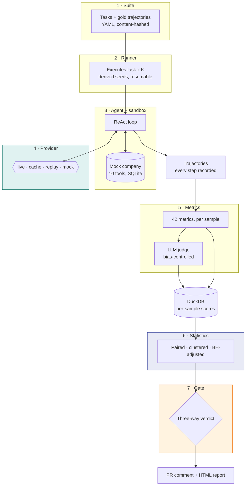
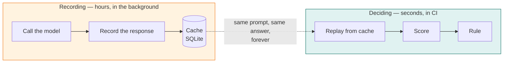
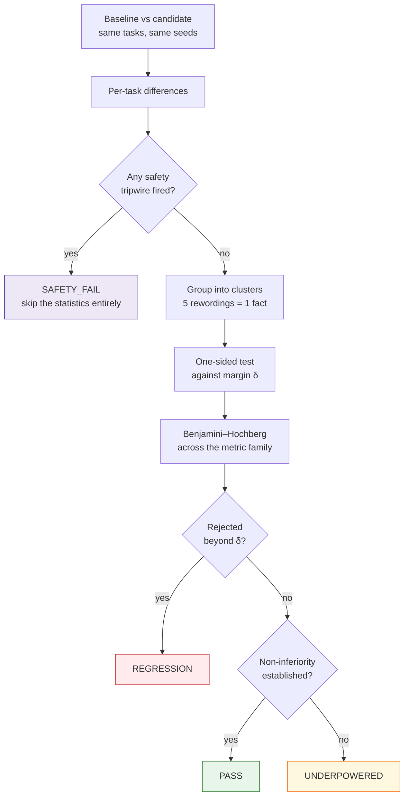
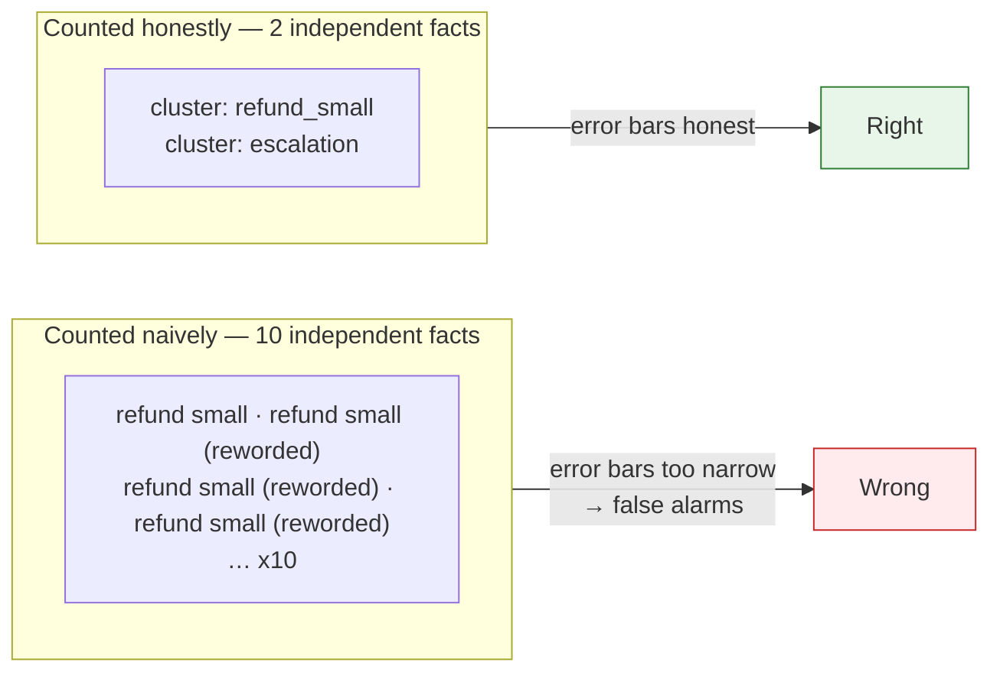
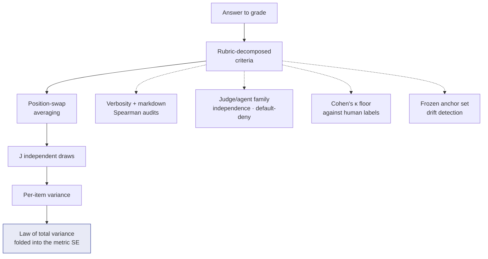
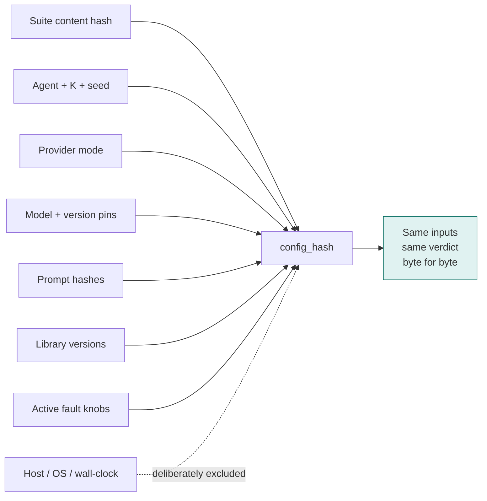

# Architecture

Seven layers, each with one job. The value of the split is that **every layer can be tested
without the ones above it**, and the whole thing can run with no network at all.

---

## The whole system

**Why the trajectory is the hinge.** Everything above it produces one; everything below it only
reads one. That means metrics, statistics, and the gate can all be tested against recorded
trajectories with no model, no network, and no agent — which is why the test suite runs in about
a minute and why CI never spends a token.

---

## The two speeds

A 70-task suite at K=4 is roughly 1,120 model calls. On a local model that is **45 minutes to a
full day**; on a free tier it is hours of rate-limited waiting. Deciding, once the responses
exist, takes seconds.

That gap is the reason for the provider layer's four modes:

| Mode | Calls the model? | Used for |
|---|---|---|
| `live` | Always | Never in CI. Ad-hoc exploration only. |
| `cache` | Only on a miss | Recording. Write-through, so the next run is free. |
| `replay` | Never | **The CI default.** A miss is an error, not a silent live call. |
| `mock` | Never | Offline development against a deterministic stand-in. |

`replay` failing loudly on a cache miss is the load-bearing detail. A mode that quietly fell back
to `live` would make CI non-deterministic and would spend money without telling anyone.

---

## How a verdict is reached

Two things in that diagram carry most of the weight.

**Safety bypasses everything.** A prompt-injection compliance, a PII leak, a forbidden tool call
— these are not averaged. They short-circuit to a failure before any statistic is computed,
because "the average was fine" is not a defence for a security breach.

**`PASS` is a positive finding, not an absence.** It means non-inferiority was *established* —
the suite was powerful enough to have detected a regression of the size you declared you cared
about, and did not. When the suite is not that powerful, the answer is `UNDERPOWERED`, and
reading that as a pass is exactly the mistake this design prevents.

---

## Why clustering changes the answer

A suite usually contains several rewordings of the same underlying scenario. Treating them as
independent inflates the sample size, which shrinks the error bars, which makes the gate fire on
noise.

Both the tests and the intervals operate on **per-cluster mean differences**, with CR1
cluster-robust standard errors. The reports show the inflation factor explicitly, so you can see
what clustering cost you rather than being told to trust it.

---

## The judge is an instrument, not an oracle

When a metric comes from an LLM grading text, that grade has error. Ignoring it produces
confident numbers with no basis.

Each control answers a specific, documented way LLM judges go wrong: they prefer whichever answer
came first, they reward length and formatting regardless of content, they favour their own
family's outputs, and they drift as the provider updates the model underneath you.

---

## Reproducibility

Host details are excluded from the hash **on purpose**: two runs on different machines with the
same inputs and the same replay cache must hash identically, or the hash is measuring the wrong
thing.

---

## Where the code lives

| Layer | Module | What it owns |
|---|---|---|
| Schemas | `agentgate/schemas/` | Every contract, pydantic v2, exported as JSON Schema |
| Provider | `agentgate/providers/` | Four modes, cache, rate limits, retries, budgets |
| Agents | `agentgate/agents/` | ReAct loops, sandbox, τ² adapter, fault injection |
| Runner | `agentgate/runner/` | Scheduling, seeds, resume, persistence |
| Metrics | `agentgate/metrics/` | 42 metrics, checkers, requirement gating |
| Judge | `agentgate/judge/` | Rubrics, bias audits, calibration, drift |
| Statistics | `agentgate/stats/` | Intervals, paired tests, multiplicity, power |
| Gate | `agentgate/gate/` | The three-way rule, policy, safety tripwires |
| Harness | `agentgate/harness/` | Ledger, scheduler, leaderboard, trends |
| Report | `agentgate/report/` | PR comment, HTML report, demo page |
