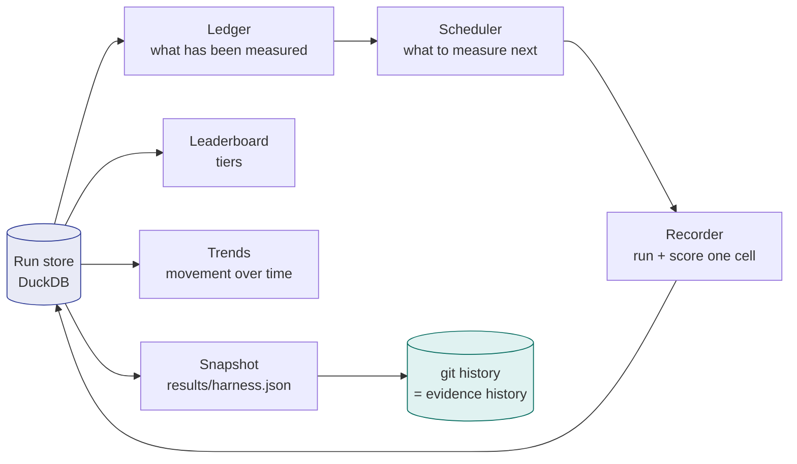
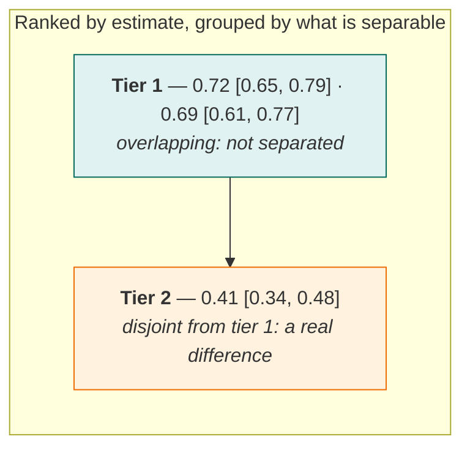

# The living harness

AgentGate is built to keep running. The gate answers one question about one pull request; the
harness answers the standing question — **what do we currently know about which models, how sure
are we, and what is the most valuable thing to measure next?**

Everything here is derived from the run store, so there is no second source of truth to drift.

---

## The loop



The unit of work is a **cell**: one model, on one suite, at one K. Cells are deliberately coarse.
A finer unit would let the harness record half a suite against a model and then report it beside
complete measurements — and a leaderboard built from ragged coverage compares models on different
tasks while looking like it compares them on the same ones.

```bash
agentgate harness status              # coverage: what has been measured, how completely
agentgate harness next --minutes 60   # what it would record next, and why
agentgate harness record --minutes 60 # record a session; resumable and interruptible
agentgate harness export              # commit a snapshot of what was learned
```

---

## The leaderboard reports tiers, not positions

This is where the project could most easily betray its own thesis.

Sorting models by point estimate and printing 1, 2, 3 asserts an ordering between **every adjacent
pair** — a large family of comparisons, each made at no stated confidence, on samples usually far
too small to support any of them. It is exactly the error the gate exists to prevent in CI, and
putting it in the project's own scoreboard would be indefensible.

So models are ordered by estimate and then **grouped into tiers**: a model joins the current tier
while its interval still overlaps the tier leader's. Within a tier, the answer is *we cannot
separate these*.



### Two details that make the tiering honest

**Overlap is tested against the tier leader, never the predecessor.** Chained overlap is not
transitive: `a` can overlap `b` and `b` overlap `c` while `a` and `c` are disjoint. Comparing each
model to its immediate predecessor would collapse all three into one tier, asserting that `a` and
`c` are indistinguishable when their intervals do not touch. That is the transitivity trap, and it
makes naive tiering worse than no tiering at all.

**The rule is conservative in a stated direction.** Non-overlapping intervals imply a real
difference. The converse is **false** — two intervals can overlap comfortably while a paired test
rejects, because pairing removes the between-task variance that dominates both marginal intervals.

!!! warning "Shared tier membership is not evidence of equivalence"

    A tier boundary is strong evidence of a difference. Shared membership is only an *absence of
    evidence from this view*. When two models ran the same tasks, ask the question properly:

    ```bash
    agentgate versus --suite tau2_retail --baseline MODEL_A --candidate MODEL_B
    ```

    That runs the paired test on the tasks both models faced, and it is strictly more powerful
    than reading two marginal intervals off the board. The leaderboard's own verdict line points
    you there whenever a tier holds more than one model.

---

## Trends apply the same standard to time

A running project accumulates repeated measurements of the same cell, and the obvious thing to do
with them — draw a line, read a slope — is the easiest way to manufacture a finding. Two points
differing by three percentage points mean nothing when each carries a twelve-point interval.

`agentgate trend` reports movement **only when consecutive intervals fail to overlap**, and labels
everything else as noise.

It also refuses to compare across a changed suite. If the suite's content hash moved between two
recordings, the two scores answer different questions, and the trend reports `incomparable` rather
than drawing a line through the discontinuity.

---

## Scheduling: breadth before depth

The harness runs against free tiers and a laptop, so its budget is minutes and its appetite is
every model times every suite. The ordering rule is **breadth before depth**, and that is a
statistical claim rather than a preference:

- A model with **no** recording carries unbounded uncertainty. Nothing can be said about it, and
  no comparison involving it is possible.
- A model with a **partial** recording carries merely wide uncertainty.

Spending the next minute on the first kind removes strictly more uncertainty than deepening the
second — so breadth wins until every cell has been touched once.

**Models with unmeasured throughput are deferred, not guessed at.** An untimed model might be a
reasoning model at 75 seconds a call, and letting one into a session first can consume the entire
budget on a single cell.

The planner's own output is the clearest argument for the whole cache/replay design:

```
1  smoke/ollama_chat/llama3.2:3b@K3   never measured   ~4 min
deferred: tau2_retail/ollama_chat/llama3.2:3b@K3   ~53 min
deferred: tau2_retail/ollama_chat/qwen3:4b@K3      ~27.8 h
deferred: */ollama_chat/qwen2.5:7b@K3              unmeasured throughput
```

Recording is measured in hours. Deciding is measured in seconds. That gap is why the provider layer
records once and replays forever, and why CI never calls a model at all.

---

## The evidence base is the git history

The run store is the source of truth and it is **not** committed: tens of megabytes of full
trajectories, growing without bound, and regenerable from the provider cache.

What *is* committed is the derived summary, `results/harness.json` — small, diffable, and the thing
a reader actually wants. Because it is committed, **every recording session leaves a reviewable
diff of what the project learned.** That is what makes "this project improves itself over time" an
auditable claim rather than a slogan.

Two rules keep the snapshot honest:

- **Every estimate carries its interval and its n.** A bare number in a JSON file is precisely the
  artifact this project argues against, and the one most likely to be copied into a slide without
  its uncertainty.
- **Skipped metrics are omitted, never zero-filled.** A metric that did not apply to a suite is
  absent, because writing `0.0` makes a category error look like a catastrophic score.

That second rule was not theoretical. See [Current results](results.md) for the defect it caught.
