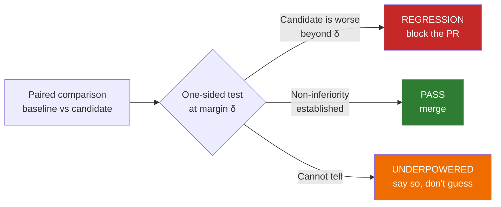
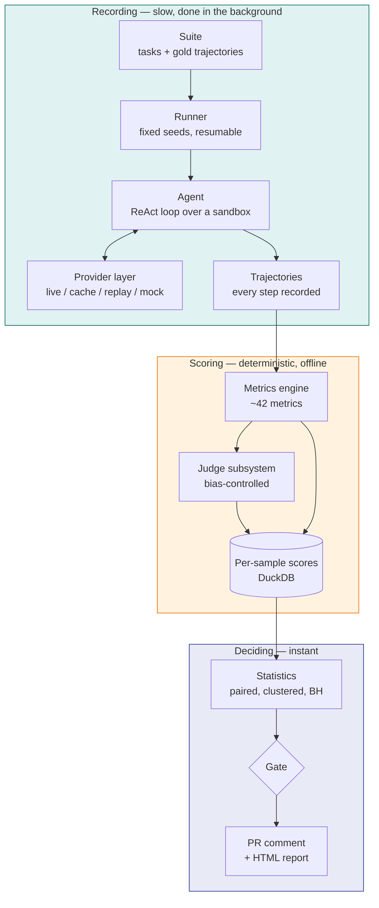

# AgentGate

**A CI check that blocks a pull request only when an agent has *statistically significantly*
regressed.**

Agent evaluation has a measurement problem. Scores move between runs because models are stochastic,
so a team watching a dashboard sees a number drop from 0.72 to 0.68 and has no way to know whether
that is a regression or Tuesday. The two available responses are both bad: block on every dip and
the gate gets muted within a week, or block on nothing and real regressions ship.

AgentGate answers the question the dashboard cannot: **is this difference larger than the noise?**

---

## The verdict is three-way, not two

Most gates are binary — pass or fail — which forces the system to pretend it knows things it does
not. AgentGate returns one of three verdicts, and the third is the one that matters.

**UNDERPOWERED is not a failure mode — it is the honest answer to a small sample.** A gate that
returns PASS when it simply lacks the data to detect a regression is lying, and the lie is
invisible precisely when it is most expensive. AgentGate reports the minimum detectable effect
instead, so you know what the suite *could* have caught.

---

## Why the numbers are trustworthy

Four decisions do most of the work.

=== "Pairing"

    Baseline and candidate run **identical task instances with identical seeds**. Task difficulty
    varies enormously, and that variance dominates any unpaired comparison. Pairing cancels it:
    with a 0.3–0.7 score correlation between systems, the same suite detects a substantially
    smaller effect than it otherwise could.

=== "Clustering"

    Five paraphrases of one scenario are **one fact, not five**. Treating them as independent
    inflates the effective sample size and makes the gate anti-conservative — it fires on noise.
    Both the tests and the intervals operate on per-cluster mean differences, with CR1 sandwich
    standard errors.

=== "Multiplicity"

    Gating on 40 metrics at α=0.05 produces a false alarm roughly 87% of the time by chance
    alone. Benjamini–Hochberg FDR control across the gated family fixes that, and rejections are
    derived from the adjusted p-values rather than a separate threshold rule that can disagree
    with them.

=== "Judge uncertainty"

    When a metric comes from an LLM judge, the judge's own variance is propagated into the
    metric's standard error through the law of total variance. A judged score with hidden
    variance is a confident number with no basis.

---

## The system

The split matters. Recording a suite against a local model takes **hours**; deciding takes
**seconds**. So the provider layer records once and replays forever, and CI never calls a model at
all — it replays from cache, which also makes the verdict reproducible byte-for-byte.

---

## It is a running project

AgentGate does not produce one report and stop. It accumulates evidence about models over time,
and the [living harness](harness.md) tracks what it knows, plans what to measure next under a
wall-clock budget, and ranks results **without claiming an order the evidence cannot support**.

Every recording session commits a diff of what the project learned. The current evidence base is
on the [results page](results.md).

---

## What it does not do

Read [Limitations](limitations.md) before trusting anything here. The short version: the suites are
small relative to production traffic, the judge is a model with its own biases (measured, not
assumed away), and the τ²-bench adaptation is single-turn where the original is multi-turn — so
those scores are **not** comparable to a τ²-bench leaderboard.

Stating these plainly is not a disclaimer. It is the same discipline as the UNDERPOWERED verdict.
